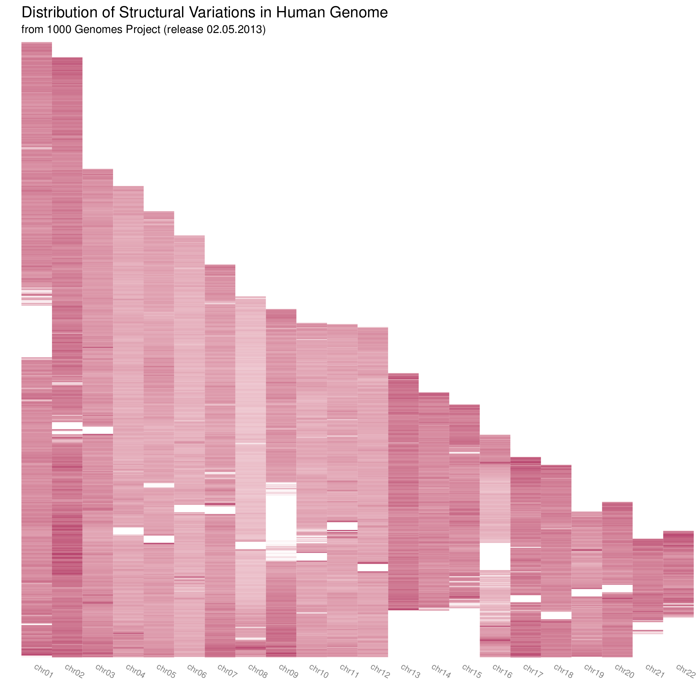

Genomic Variation Spectrum
==========================
The R script generates a heatmap where y axis represents the genomic locations
and the colour shows the density of the variations in different locations in the
genome(s).

